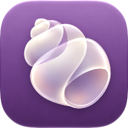
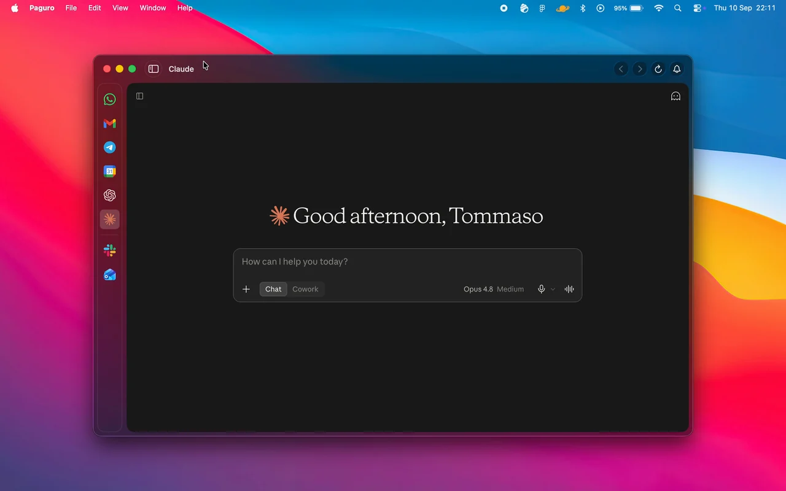

<p align="center">
  
</p>

<h1 align="center">Paguro</h1>

<p align="center">
  Every web app you keep in a browser tab, in one native macOS window.<br>
  Free, open source, and every login stays on your Mac.
</p>

<p align="center">
  <a href="#install-on-a-mac">Install</a> &middot;
  <a href="#what-paguro-provides">Features</a> &middot;
  <a href="#your-data">Privacy</a> &middot;
  <a href="#build-the-app">Build</a> &middot;
  <a href="docs/ARCHITECTURE.md">Docs</a> &middot;
  <a href="https://github.com/anguria-studio/Paguro/issues">Issues</a>
</p>

<p align="center">
  <!-- Add the Code quality badge once this repository is public; Actions badge
       images return 404 to anonymous requests while a repository is private:
       <a href="https://github.com/anguria-studio/Paguro/actions/workflows/code-quality.yml"></a> -->
  <a href="#install-on-a-mac"></a>
  <a href="LICENSE"></a>
</p>

<p align="center">
  
</p>

Chat, mail, calendars, the sites you leave open all day: one sidebar switches
between them, and each account keeps its own login session. Workspaces group
them, native notifications land in Notification Center, and an optional island
near the notch shows what just arrived. No account, no telemetry, no
subscription, and every feature is free.

Third-party services can require their own accounts or subscriptions.
Bundled data and dependencies have their own licenses; see
[Third-party notices](THIRD_PARTY_NOTICES.md).

Paguro is a free, open-source fork of [Chorus](https://github.com/nicojan/Chorus),
created by [Nico Jan](https://github.com/nicojan). See [Credits](#credits) for
the full attribution.

## Release status

The first public release, **1.0.0**, is being prepared. There is no public Paguro
download yet. The local signed builds and Sparkle update path have passed their
initial checks; public download and final release checks are still pending.

## What Paguro provides

- **A separate session for every service.** Each service gets its own
  `WKWebsiteDataStore`. A personal and a work account for the same site stay
  signed in side by side and share no cookies.
- **Workspaces.** Group services into workspaces, and keep a service in more
  than one. Sessions stay isolated per instance.
- **Badges and notifications.** Unread counts reach the Dock and the menu bar.
  Mute a single service, a whole workspace, or everything at once, and set
  quiet hours for the times you do not want interrupting.
- **The notch island.** An optional strip near the MacBook notch shows what
  just arrived.
- **Memory-aware hibernation.** Idle services release memory and wake where you
  left them. Each service picks its own policy: follow the global setting, never
  hibernate, hibernate on switching away, or hibernate after an idle wait.
- **Ad and tracker blocking.** The HaGezi and Fanboy lists block known ad and
  tracking domains across your services. This leaves the ads a site serves from
  its own domain.
- **Camera and microphone control.** Video calls work where you need them. Set a
  policy per service or a default for all of them, and mute every microphone
  with **⇧⌘M**.
- **App lock.** Touch ID or your Mac password locks the app, and Paguro hides
  notification contents while the lock holds.
- **Keyboard control.** Switch services with **⌘K**, search a page with **⌘F**,
  reload with **⌘R**, and move between services with **⌃Tab**.
- **Per-service appearance.** Send a native light or dark signal to each
  service, and apply your own CSS where a site needs it.
- **Configuration export and import**, carrying your setup to another Mac
  without carrying login sessions.
- **Signed updates** in the direct-download build.

Paguro ships 73 preset services and accepts any other site by its URL.
Third-party websites control their own features and sign-in requirements.
Paguro does not guarantee support for every website feature.

## Install on a Mac

Paguro requires **macOS 15 or later**, on Apple silicon or Intel.
Liquid Glass requires macOS 26; earlier systems use the fallback appearance.
You do not need Xcode to use a downloaded release.

Once the first release is published:

1. Open the [Paguro releases page](https://github.com/anguria-studio/Paguro/releases).
2. Download the `.dmg` attached to the latest stable release.
3. Open the disk image and drag **Paguro.app** into **Applications**.
4. Open Paguro from Applications and follow the setup prompts.
5. Add your services and sign in to each account.

Direct releases use Developer ID signing and Apple notarization.
Allow notifications if you want macOS banners. Services ask for camera or
microphone access when needed. Paguro itself does not need an account.

For updates, choose **Paguro → Check for Updates…**. You can enable automatic
checks in **Settings → About**. Builds made before Sparkle integration need
one manual installation of a newer DMG.

## Your data

Service sessions stay in separate WebKit stores on your Mac. Paguro does not
sync login sessions or send app telemetry. The websites you open connect to
their providers and follow those providers' privacy policies.
Closing the main window keeps Paguro running in the menu bar. Choose
**Paguro → Quit Paguro** or press **⌘Q** to stop service activity.

## Build requirements

- Xcode 26 or later, with Swift 6
- macOS 26 for building the Icon Composer app icon
- [XcodeGen](https://github.com/yonaskolb/XcodeGen)

The built app supports macOS 15 and later. Vale is optional for local writing
checks; GitHub Actions checks documentation on pull requests.

## Build the app

```sh
git clone https://github.com/anguria-studio/Paguro.git
cd Paguro
xcodegen generate
xcodebuild \
  -project Paguro.xcodeproj \
  -scheme Paguro \
  -configuration Debug \
  build
```

You can also open `Paguro.xcodeproj` in Xcode, choose the **Paguro** scheme,
and press **⌘R**. Use **Paguro Island Preview** to test a simulated notch.
Development builds do not contain Sparkle. See [Distribution](docs/features/DISTRIBUTION.md)
for the signed direct-release build process.

Run the core tests with this command:

```sh
swift test --package-path Core
```

Run the app tests with this command:

```sh
xcodebuild \
  -project Paguro.xcodeproj \
  -scheme Paguro \
  -configuration Debug \
  test
```

## Documentation

- [Architecture](docs/ARCHITECTURE.md)
- [Design choices](docs/DESIGN.md)
- [Dependency policy](docs/DEPENDENCIES.md)
- [Native shell](docs/features/NATIVE_SHELL.md)
- [Application lifecycle](docs/features/APP-LIFECYCLE.md)
- [Notification system](docs/features/NOTIFICATIONS.md)
- [Island and notch support](docs/features/ISLAND.md)
- [Web sessions](docs/features/WEB-SESSIONS.md)
- [Web appearance](docs/features/WEB-APPEARANCE.md)
- [Service icons](docs/features/SERVICE-ICONS.md)
- [Compatibility fixture](docs/features/COMPATIBILITY.md)
- [Distribution](docs/features/DISTRIBUTION.md)

## Contributing

Bug reports and pull requests are welcome. See [Contributing](CONTRIBUTING.md)
to get set up.

## Credits

Paguro is a fork of [Chorus](https://github.com/nicojan/Chorus), created by
[Nico Jan](https://github.com/nicojan), and builds on its native macOS and
WebKit foundation. Paguro is a separate project that preserves the upstream
copyright notices and Git history.

## License

Paguro uses the MIT License.
See [LICENSE](LICENSE).

Service names and logos belong to their respective owners.
Paguro uses them only to identify a service.
