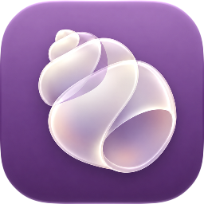
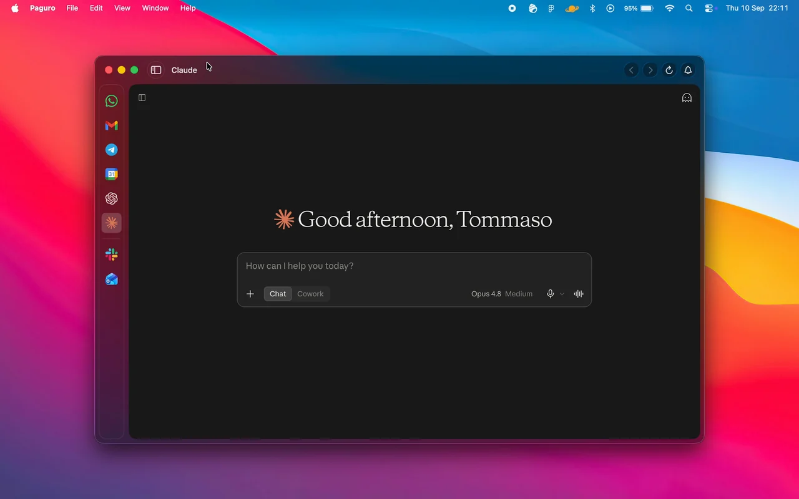

<p align="center">
  
</p>

<h1 align="center">Paguro</h1>

<p align="center">
  Every web app you keep in a browser tab, in one native macOS window.<br>
  Free, open source, and every login stays on your Mac.
</p>

<p align="center">
  <a href="#install-on-a-mac">Install</a> &middot;
  <a href="#features-at-a-glance">Features</a> &middot;
  <a href="#your-data">Privacy</a> &middot;
  <a href="CHANGELOG.md">Changelog</a> &middot;
  <a href="#build-the-app">Build</a> &middot;
  <a href="docs/README.md">Docs</a> &middot;
  <a href="https://github.com/anguria-studio/Paguro/issues">Issues</a>
</p>

<p align="center">
  <a href="https://github.com/anguria-studio/Paguro/actions/workflows/code-quality.yml"></a>
  <a href="https://github.com/anguria-studio/Paguro/releases/latest"></a>
  <a href="#install-on-a-mac"></a>
  <a href="#your-data"></a>
  <a href="#install-on-a-mac"></a>
  <a href="LICENSE"></a>
</p>

<p align="center">
  
</p>

**[Download Paguro for macOS](https://github.com/anguria-studio/Paguro/releases/latest)**
 · macOS 15+ · Apple silicon and Intel · Signed and notarized

Or install with [Homebrew](https://brew.sh):

```sh
brew install --cask anguria-studio/tap/paguro
```

## Why Paguro?

Chat, mail, calendars, and the sites you leave open all day, together in one window.

- **Keep accounts separate.** Work and personal accounts stay signed in side by side, with separate cookies and sessions.
- **Organize your day.** Group services into workspaces and switch between them from one sidebar.
- **Stay informed.** Get native notifications, unread badges, and optional alerts near the MacBook notch.
- **Keep control.** No Paguro account, no app telemetry, and no subscription. Every feature is free.

Paguro is a fork of [Chorus](https://github.com/nicojan/Chorus), created by
[Nico Jan](https://github.com/nicojan). See [Credits](#credits).

## Features at a glance

### 🗂️ Accounts and workspaces

| Feature | What you can do |
| --- | --- |
| Separate sessions | Use several accounts for the same site without sharing cookies. |
| Workspaces | Group services and keep a service in more than one workspace. |
| Website catalog | Choose from 73 website presets, or add a custom URL. A Notification Test entry is also available. |
| Configuration transfer | Export and import your setup without copying login sessions. |

### 🔔 Notifications and focus

| Feature | What you can do |
| --- | --- |
| Native notifications | See alerts in Notification Center and unread counts in the Dock and menu bar. |
| Mute and quiet hours | Mute one service, a workspace, or everything. Schedule quiet hours. |
| Optional island | See incoming alerts in a strip near the MacBook notch. |
| App lock | Lock with Touch ID or your Mac password. Notification contents stay hidden while locked. |

### ⚙️ Everyday controls

| Feature | What you can do |
| --- | --- |
| Memory-aware hibernation | Release memory from idle services. Choose a global policy or one for each service. |
| Ad and tracker blocking | Block known ad and tracking domains with HaGezi and Fanboy lists. Ads from a site's own domain remain. |
| Camera and microphone | Set access policies for each service or a default for all services. |
| Appearance | Set light or dark appearance for each service and add custom CSS. |
| Signed updates | Check for updates from the direct-download build. |

Third-party websites control their features and sign-in requirements, and can
require their own accounts or subscriptions. Paguro does not guarantee every
website feature.

<details>
<summary><strong>Keyboard shortcuts</strong></summary>

| Shortcut | Action |
| --- | --- |
| ⌘K | Switch services |
| ⌃Tab | Move between services |
| ⌘F | Search the current page |
| ⌘R | Reload the current page |
| ⇧⌘M | Mute every microphone |
| ⌘, | Open Settings |
| ⌘Q | Quit Paguro and stop service activity |

</details>

## Install on a Mac

Requires **macOS 15 or later**, on Apple silicon or Intel. You do not need Xcode.
Liquid Glass requires macOS 26; earlier systems use the fallback appearance.

1. Download the `.dmg` from the [latest release](https://github.com/anguria-studio/Paguro/releases/latest).
2. Open the disk image and drag **Paguro.app** into **Applications**.
3. Open Paguro, choose your services, and sign in to each account.

The Homebrew command above installs the same signed, notarized disk image.
Use the full cask name as shown to select the correct tap.

Allow notifications if you want macOS banners. Services ask for camera or
microphone access when needed.

<details>
<summary><strong>Updates</strong></summary>

Choose **Paguro → Check for Updates…**. Enable automatic checks in
**Settings → About**. Builds made before Sparkle integration need one manual
installation of a newer DMG.

</details>

<details>
<summary><strong>First launch, workspaces, and appearance</strong></summary>

The welcome step offers notifications and, on the selected notched display,
island alerts. Choose your services, name the workspace (Personal by default),
and select several services together. Custom website opens an editor with an
icon preview. The final step previews the app theme and window glass.
New installations start with glass Off.

Later, Add service opens the same catalog in the browser area. Its workspace
menu can create another workspace. Open Settings with **⌘,**, from the Paguro
menu, or with the gear beside Add service in the expanded sidebar.

Window glass offers Follow system on macOS 27, plus Off, Clear, and Regular.
macOS 26 offers the three manual presets. macOS 15 uses the solid palette.
Settings and editor sheets stay opaque and follow the app's light or dark theme.

</details>

## Your data

- **Sessions stay on your Mac.** Each service account has a separate WebKit data store. Paguro does not sync login sessions.
- **No app telemetry.** The websites you open connect to their providers and follow their privacy policies.
- **You control background activity.** Closing the window keeps Paguro in the menu bar. Press **⌘Q** to stop all service activity.

Read the [full privacy policy](https://anguria.studio/paguro/privacy/) for local
storage, website connections, permissions, and updates.

## Build the app

<details>
<summary><strong>Requirements, build commands, and tests</strong></summary>

### Requirements

- Xcode 26 or later, with Swift 6
- macOS 26 for building the Icon Composer app icon
- [XcodeGen](https://github.com/yonaskolb/XcodeGen)

The built app supports macOS 15 and later. Vale is optional for local writing
checks; GitHub Actions checks documentation on pull requests.

### Build and test

```sh
git clone https://github.com/anguria-studio/Paguro.git
cd Paguro
xcodegen generate
xcodebuild \
  -project Paguro.xcodeproj \
  -scheme Paguro \
  -configuration Debug \
  build
```

You can also open `Paguro.xcodeproj` in Xcode, choose the **Paguro** scheme,
and press **⌘R**. Use **Paguro Island Preview** to test a simulated notch.
Use **Paguro First Run Preview** for a fresh, isolated onboarding run. Its
services, sign-ins, and appearance choices reset each launch. The normal
**Paguro** scheme retains your saved development setup.
Development builds do not contain Sparkle. See [Distribution](docs/features/DISTRIBUTION.md)
for the signed direct-release build process.

Run the core tests with this command:

```sh
swift test --package-path Core
```

Run the app tests with this command:

```sh
xcodebuild \
  -project Paguro.xcodeproj \
  -scheme Paguro \
  -configuration Debug \
  test
```

</details>

## Documentation and contributing

| Start here | What you will find |
| --- | --- |
| [Documentation](docs/README.md) | All feature guides and technical references |
| [Architecture](docs/ARCHITECTURE.md) | App structure and service boundaries |
| [Design](docs/DESIGN.md) | Visual rules and native macOS behavior |
| [Contributing](CONTRIBUTING.md) | Development setup, checks, and pull requests |
| [Changelog](CHANGELOG.md) | Changes in each release |
| [Issues](https://github.com/anguria-studio/Paguro/issues) | Bug reports and feature requests |

## Credits

Paguro is a fork of [Chorus](https://github.com/nicojan/Chorus), created by
[Nico Jan](https://github.com/nicojan), and builds on its native macOS and
WebKit foundation. Paguro is a separate project that preserves the upstream
copyright notices and Git history.

## License

Paguro uses the MIT License.
See [LICENSE](LICENSE).

Service names and logos belong to their respective owners.
Paguro uses them only to identify a service.

Bundled data and dependencies have their own licenses. See
[Third-party notices](THIRD_PARTY_NOTICES.md).
